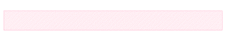
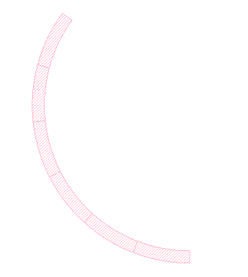
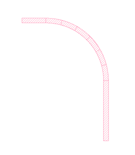
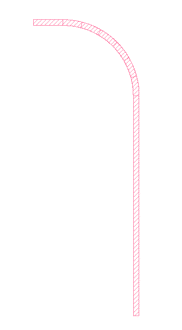
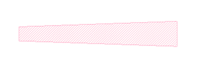
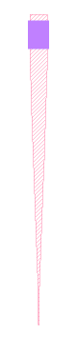
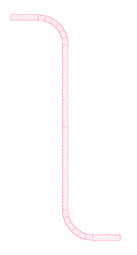
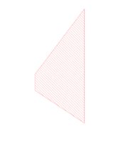
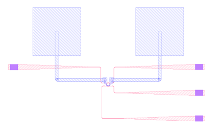

# SPLayout

 Silicon Photonics Design Tools for GDSII Files. It is based on **gdspy**([heitzmann/gdspy: Python module for creating GDSII stream files, usually CAD layouts. (github.com)](https://github.com/heitzmann/gdspy)) and can interact with it.

### Pre-Installation

* gdspy 

### Usage

#### Parallel / Vertical Waveguide

```
    start_point = Point(0,0)
    wg_end_point = Point(5,0)
    first_wg = Waveguide(start_point,wg_end_point,width=0.45)
    first_wg.draw(testCell,TEST_LAYER)
```

<p align="center">
  
</p>

#### Bend

```
    center_point = Point(0,0)
    start_angle = math.pi*4/5
    end_angle = math.pi*3/2
    width = 0.4
    radius = 5
    first_bend = Bend(center_point, start_angle, end_angle, width , radius)
    first_bend.draw(testCell,TEST_LAYER)
```


<p align="center">
  
</p>


#### Anticlockwise Quarter Bend Connector

```
    start_point = Point(0,0)
    end_point = Point(-7,10)
    width = 0.4
    first_AQuarBend = AQuarBend(start_point,end_point,width,5)
    first_AQuarBend.draw(testCell,TEST_LAYER)
```

<p align="center">
  
</p>


#### Clockwise Quarter Bend Connector

```
    start_point = Point(0,0)
    end_point = Point(-7,20)
    width = 0.4
    first_QuarBend = AQuarBend(start_point,end_point,width,5)
    first_QuarBend.draw(testCell,TEST_LAYER)
```

<p align="center">
  
</p>

#### Add-Drop Microring

```
    start_point = Point(0,0)
    radius = 5.1973
    gap = 0.18
    wg_width = 0.45
    coupling_length = 5.5
    first_ring = AddDropMicroring(start_point,radius,gap,wg_width,coupling_length)
    first_ring.draw(testCell,TEST_LAYER)
```

<p align="center">
  
</p>


#### Taper

```
    taper_start_point = Point(0,0)
    taper_length = 5
    taper_end_point = Point(taper_start_point.x+ taper_length,taper_start_point.y )
    first_taper = Taper(taper_start_point,taper_end_point,0.45,0.8)
    first_taper.draw(testCell,TEST_LAYER)
```

<p align="center">
  
</p>


#### AEMD Grating

```
    grating_port = Point(0,0)
    right_grating = AEMDgrating(grating_port,RIGHT)
    right_grating.draw(testCell)
```

<p align="center">
  
</p>

#### Double Bend Connector :star:

```
    double_connect_start_point = Point(0,0)
    double_connect_end_point = Point(-20,40)
    connector = DoubleBendConnector(double_connect_start_point, double_connect_end_point, width=1, xpercent=0.5)
    connector.draw(testCell,TEST_LAYER)
```

<p align="center">
  
</p>

#### Polygon

```
    pointlist = [Point(0,0),Point(0,1),Point(3,5),Point(3,-2)] ## or [(0,0),(0,1),(3,5),(3,-2)]
    polygon = Polygon(pointlist)
    polygon.draw(testCell,TEST_LAYER)
```

<p align="center">
  
</p>


### Example

[example_single_microring.py](https://github.com/Hideousmon/SPLayout/blob/main/example_single_microring.py) 

<p align="center">
  
</p>
