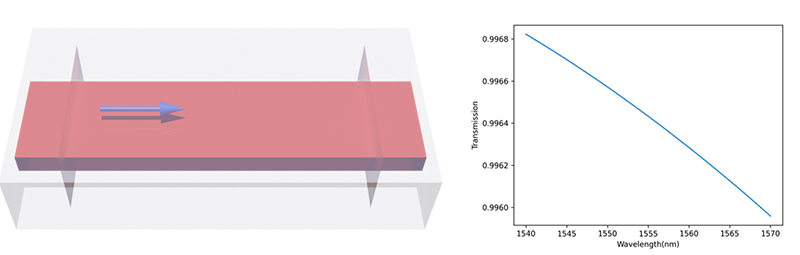

# SPLayout
[](https://github.com/Hideousmon/SPLayout) [](https://github.com/Hideousmon/SPLayout/blob/main/LICENSE) []()
[](https://GitHub.com/Hideousmon/SPLayout/stargazers/) 


SPLayout (**S**ilicon **P**hotonics **Layout** Design Tools) is a silicon photonics structures design package. It provides commonly used silicon photonics structures for fast integration and pixelated blocks for inverse design. 

The GDSII streaming is based on [gdspy](https://github.com/heitzmann/gdspy) and FDTD simulation is executed on Ansys Lumerical.

## Dependency
* Python 3.6+
* gdspy
* scipy
* numpy
* (Ansys Lumerical for FDTDSimulation and MODESimulation)

## Installation

use pip:

```
pip install splayout
```

or download from the source and build/install with:

```
python setup.py install
```

## Documentation

The documentation can be found [here](https://splayout.readthedocs.io/en/latest/).

## Forward and Inverse Design Examples
### Simulation

A basic simulation example for waveguide transmission can be found [here](https://github.com/Hideousmon/SPLayout/tree/main/examples/simulation/waveguide.py).



### Direct Binary Search

A polarization beam splitter inverse design example can be found [here](https://github.com/Hideousmon/SPLayout/tree/main/examples/inversedesign/PBS_DBS.py). The [Extinction Ratio](__img/PBS_extinction_ratio.png) and [Transmission](__img/PBS_transmission.png) are comparable to the original [paper](https://doi.org/10.1038/nphoton.2015.80).


## References for Inverse Design Methods

[1] Mirjalili, S., Mirjalili, S.M. & Yang, XS. Binary bat algorithm. Neural Comput &Applic 25, 663–681 (2014). https://doi.org/10.1007/s00521-013-1525-5

[2] Shen, B., Wang, P., Polson, R. et al. An integrated-nanophotonics polarization beamsplitter with 2.4 × 2.4 μm2 footprint. Nature Photon 9, 378–382 (2015). https://doi.org/10.1038/nphoton.2015.80

[3] Christopher M. Lalau-Keraly, Samarth Bhargava, Owen D. Miller, and Eli Yablonovitch. Adjoint shape optimization applied to electromagnetic design. Opt. Express 21, 21693-21701 (2013). https://doi.org/10.1364/OE.21.021693 & https://github.com/chriskeraly/lumopt


### [History (Click Here)](https://github.com/Hideousmon/SPLayout/tree/main/history.md)

