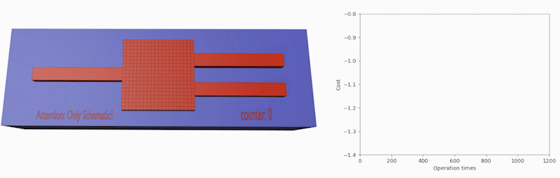

# SPLayout
[](https://github.com/Hideousmon/SPLayout) [](https://github.com/Hideousmon/SPLayout/blob/main/LICENSE) []()

SPLayout (**S**ilicon **P**hotonics **Layout** Design Tools) is a package for silicon photonics structures design. It provides commonly used silicon photonics structure classes for fast integration and pixelized blocks for inverse design and optimization. Some inverse design algorithms are also integrated in it like DBS (Direct Binary Search) and BBA (Binary Bat Algorithm). 

The GDSII streaming is based on [gdspy](https://github.com/heitzmann/gdspy) and FDTD simulation is executed on Ansys Lumerical.

## Dependency
* Python3.6/ 3.7/ 3.8
* gdspy
* scipy
* numpy
* (Ansys Lumerical for FDTDSimulation and MODESimulation)

## Installation

use pip:

```
pip install splayout
```

or download from the source and build/install with:

```
python setup.py install
```

## Documentation

The documentation can be found [here](https://splayout.readthedocs.io/en/latest/).

## Inverse Design Examples
### Direct Binary Search
A polarization beam splitter inverse design example can be found [here](https://github.com/Hideousmon/SPLayout/tree/main/examples/inversedesign/PBS_DBS.py) .The [Extinction Ratio](__img/PBS_extinction_ratio.png) and [Transmission](__img/PBS_transmission.png) are comparable to the original [paper](https://doi.org/10.1038/nphoton.2015.80).


## References for Inverse Design Methods

[1] Mirjalili, S., Mirjalili, S.M. & Yang, XS. Binary bat algorithm. Neural Comput &Applic 25, 663–681 (2014). https://doi.org/10.1007/s00521-013-1525-5

[2] Shen, B., Wang, P., Polson, R. et al. An integrated-nanophotonics polarization beamsplitter with 2.4 × 2.4 μm2 footprint. Nature Photon 9, 378–382 (2015). https://doi.org/10.1038/nphoton.2015.80

[3] Christopher M. Lalau-Keraly, Samarth Bhargava, Owen D. Miller, and Eli Yablonovitch. Adjoint shape optimization applied to electromagnetic design. Opt. Express 21, 21693-21701 (2013). https://doi.org/10.1364/OE.21.021693 & https://github.com/chriskeraly/lumopt


## History

### Version 0.0.1 (Jun 29, 2021)

* Initial release

### Version 0.0.2 (Jun 30, 2021)

* Fix a fatal bug in version 0.0.1 that Selfdefinecomponent can not work with multi-components.

### Version 0.0.3 (Jul 1, 2021)

* Add document.
* Fix a bug that the microring can not return the right pad point when it is rotated.
* Fix a bug horizonal -> horizontal.
* Fix a bug Point.\__eq__ will return False when other==None.

### Version 0.0.4 (Jul 21, 2021)

* Lift restrictions on taper length.
* Support coordinate transfer for MAKE_COMPONENT.

### Version 0.0.5 (Jul 24, 2021)

* Add self.get_start_point() for AEMD_grating.
* New Class: SBend & ASBend.
* Add a constant: pi = math.pi.

### Version 0.0.6 (Jul 27,2021) & Version 0.0.7 (Jul 28, 2021)

* SBend docs update.
* Variable names: angle -> radian.
* AEMD gratings can have multiple definitions in a file.
* AEMD Grating default relative position: RIGHT.
* New cell function: self.remove_components().
* If the input filename of "make_gdsii_file" is not "*.gds", it will automatically add ".gds" to the tail.
* New class: Circle, Rectangle.
* Add port points definition for Polygon.

### Version 0.1.4 & Version 0.1.5 (Sep 6, 2021)

* FDTD API added.
* Binary Bat Algorithm & Direct Binary Search Algorithm for inverse design.

### Version 0.1.6 (Sep 17, 2021)

* README.rst for pypi ducumentation.
* Support numpy array for Polygon definition.
* Annotation for DBS run.
* Support cell flatten.
* Fix a bug: initial_solution in DirectBianrySearchAlgorithm can not be properly defined.


### Version 0.1.8 (Sep 25, 2021)

* Able to derive phase information from monitor.
* Able to create rectangle&circle pixels with fdtd functions.


### Version 0.1.9 (Sep 29, 2021)

* Pixels region for inverse design.
* Variable names: point1 -> bottom_left_corner_point, point2 -> top_right_corner_point.

### Version 0.2.0 (Oct 29, 2021)

* Component drawing functions on fdtd_engine with z_start, z_end and material. .
* Tuple support for definitions.
* Float index to define material in fdtd (object defined dielectric).
* Lumerical script eval for fdtd.
* ArbitraryAngleWaveguide class.
* Example for DBS.
* Width property for waveguides.
* Fix a bug for unexpected rotation in SelfDefineComponent.
* Self.start_point -> self.start_point_for_return in func:get_start_point of SelfDefineComponent.
* Able to get backward transmission from mode expansion monitor.

### Version 0.2.1 (Nov 3, 2021)

* ASBend & SBend bugs fixed for 'z_start' attribute missing.
* AQuarBend & QuarBend bugs fixed for unacceptable 'tuple' parameters.
* DoubleBendConnector bugs fixed for wrong type definition. 

### Version 0.2.2 (Nov 9, 2021)

* Fix bugs for MAKE_COMPONENT rotation errors.
* Microring add_heater should generate conductor layer on the heater layer.
* More functions for MODE varFDTD simulation tools. 
* Rename a function in fdtdapi: add_source -> add_mode_source.
* Function for removing cells.
* Function for renaming all drawing on Lumerical CAD.

### Version 0.2.3 (Nov 10, 2021)

* Anti-Symmetry boundary condition choice for FDTD simulation region.
* Fix bugs for material definition with float type parameter.
* Fix bugs for putting round on Lumerical CAD.
* Support Fundamental TE mode for add_mode_source in fdtdapi.

### Version 0.2.4 (Nov 13, 2021)

* Anti-Symmetry boundary condition choice for FDTD simulation region.
* Fix bugs for material definition with float type parameters.
* Fix bugs for putting round on Lumerical CAD.
* Support fundamental TE mode for add_mode_source in fdtdapi.


### Version 0.2.5 (Nov 26, 2021)

* add_index_region, add_field_region, add_mesh_region can be defined by z_min&z_max.
* Support Fundamental TE mode for add_mode_expansion in fdtdapi.
* Fix a bug for get_transmission error.

### Version 0.2.6 (Dec 13, 2021)

* Fix a bug for mismatching axises in pixelsregion.
* Fix a bug for wrong data-pass with  Scientific notation.
* Able to set amplitude and phase for mode source.
* New Function for fdtdapi: reset_source_amplitude and reset_source_phase.
* Fix a bug for wrong SelfMadeComponent rotation.

### Version 0.2.7 (Dec 16, 2021)
* New Classes for Inverse Design with Adjoint Method: ShapeOptRegion2D, ShapeOptRegion3D, TopologyOptRegion2D, TopologyOptRegion3D, AdjointForShapeOpt, AdjointForTO. 

### Version 0.2.8 (Dec 21, 2021)
* Fix a bug for mesh region error in FDTDSimulation.
* Add draw functions for CirclePixelsRegion&RectanglePixelsRegion.
* *load_file* param for FDTDSimulation & MODESimulation.

### Version 0.2.9 (Dec 22, 2021)
* Periodic boundary condition in y-axis direction for FDTD region.
* Fix a bug for wrong SelfMadeComponent rotation.

### Version 0.3.1 (Dec 28, 2021)
* Fix a bug for wrong field region definition in z-axis.
* Fix a bug for wrong initialization of RectanglePixelsRegion.