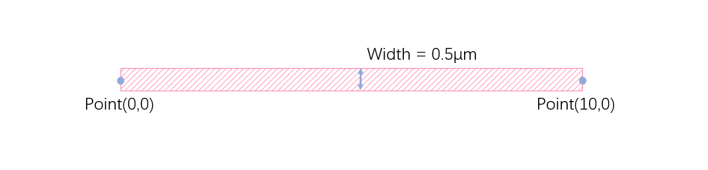
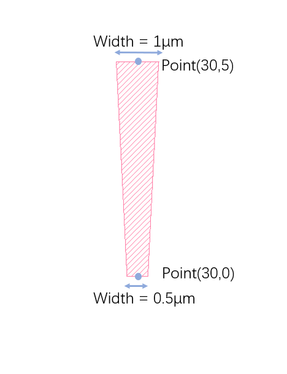
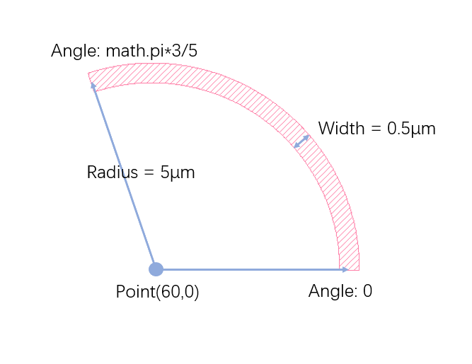
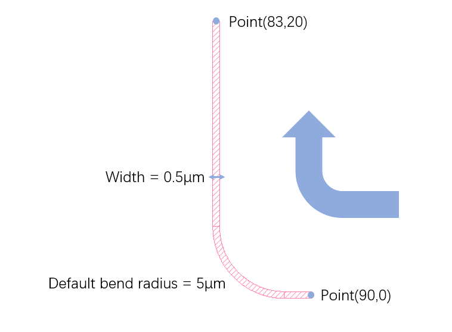
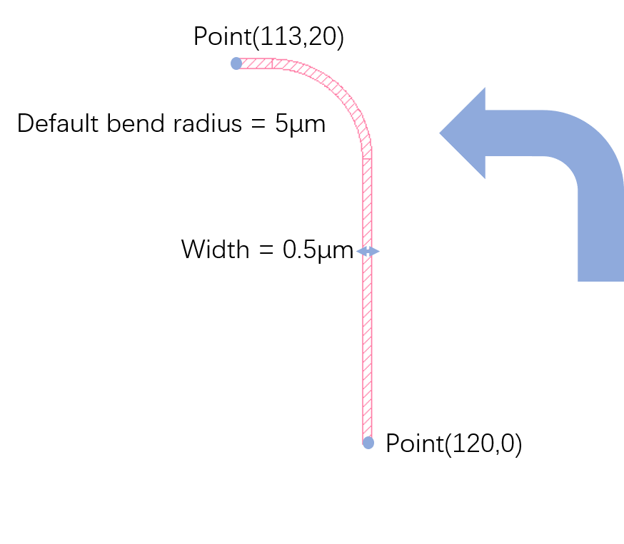
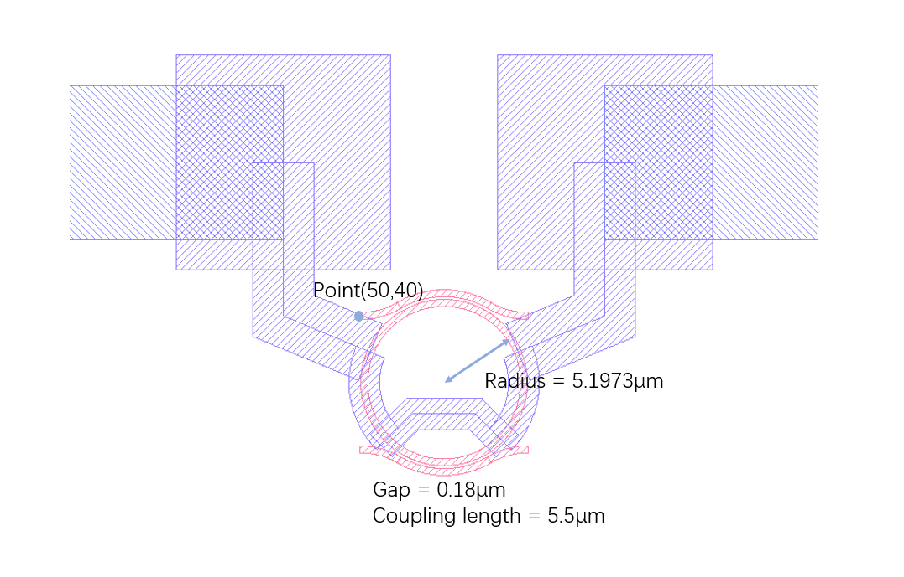
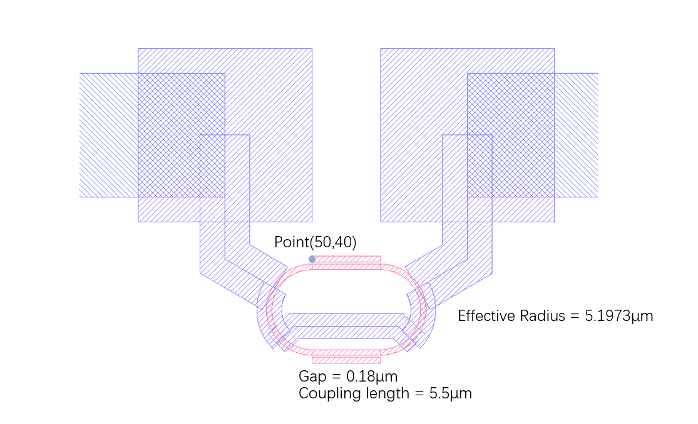
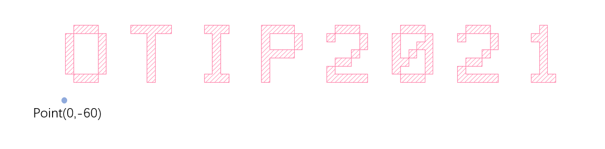
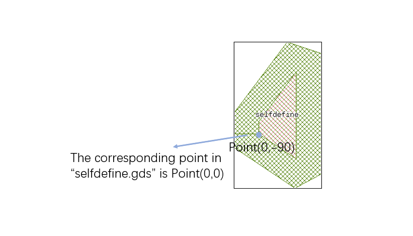
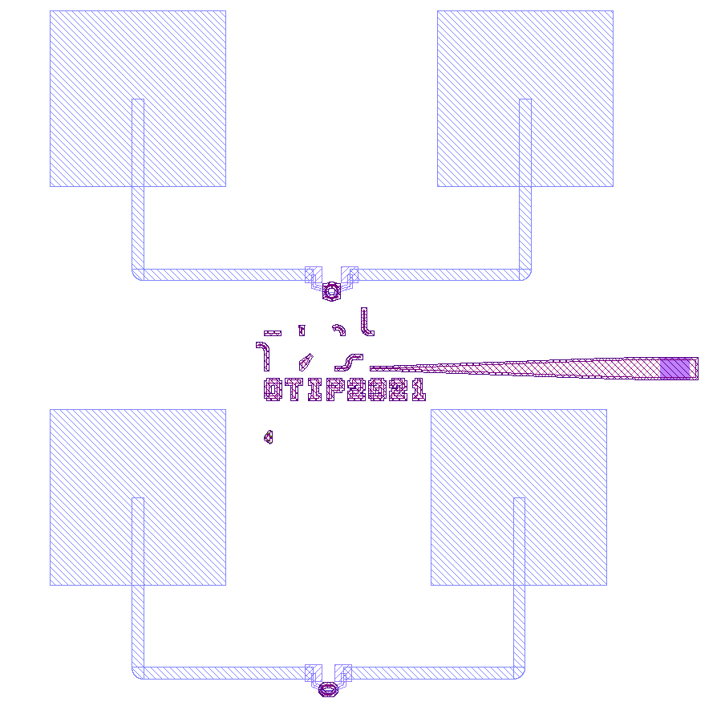

# Getting Started


SPLayout aims to accelerate the layout design process in Silicon Photonics. Most of the operations are simplified by losing some flexibility compared with its dependency [gdspy](https://github.com/heitzmann/gdspy) . The basic thought of SPLayout is that the connection between two components should be quickly made according to the center points of thier ports. 


## First GDSII

Let's create a gdsii file with a basic waveguide.

```python
from splayout import *

# define cell 
cell = Cell("waveguide")
# define layer
wg_layer = Layer(1,0)

# start point and end point for the waveguide
wg_start_point = Point(0,0)
wg_end_point = wg_start_point + (10,0)
# make a waveguide
wg = Waveguide(wg_start_point,wg_end_point,width=0.5)
# draw the waveguide on the layout
wg.draw(cell,wg_layer)

# create file and save
make_gdsii_file("waveguide.gds")
```

Firstly, we create a cell named "waveguide". We define a waveguide from Point(0,0) to Point(10,0) with 0.5μm width and draw it on the "1/0" layer. Finally, we generate the file "waveguide.gds" in the same folder with the python file.

We can check the gdsii file "waveguide.gds" with some gdsii editors such as [KLayout](https://klayout.de/).


## Components

These can be found in [example/basic.py](https://github.com/Hideousmon/SPLayout/blob/main/examples/basic.py) .

### Waveguide

```python
# start point and end point for the waveguide
wg_start_point = Point(0,0)
wg_end_point = wg_start_point + (10,0)
# make a waveguide
wg = Waveguide(wg_start_point,wg_end_point,width=0.5)
# draw the waveguide on the layout
wg.draw(cell,wg_layer)
```




### Taper

```python
# start point and end point for the taper
tp_start_point = Point(30,0)
tp_end_point = tp_start_point + (0,5)
# make a taper
tp = Taper(tp_start_point,tp_end_point,start_width=0.5,end_width=1)
# draw the taper on the layout
tp.draw(cell,wg_layer)
```




### Bend

```python
# center point and angle for the bend
center_point = Point(60,0)
start_angle = math.pi*0
end_angle = math.pi*3/5
width = 0.5
radius = 5
# make a bend
first_bend = Bend(center_point, start_angle, end_angle, width , radius)
# draw the bend on the layout
first_bend.draw(cell,wg_layer)
```




### QuarBend

```python
# start point and end point for the quarbend
start_point = Point(90,0)
end_point = start_point + (-7,20)
# make a quarbend
first_QuarBend = QuarBend(start_point,end_point,width=0.5)
# draw the quarbend on the layout
first_QuarBend.draw(cell,wg_layer)
```




### AQuarBend

```python
# start point and end point for the anti-clockwise quarbend
start_point = Point(0,-30)
end_point = start_point + (-7,20)
# make the anti-clockwise quarbend
first_AQuarBend = AQuarBend(start_point,end_point,width=0.5)
# draw the anti-clockwise quarbend on the layout
first_AQuarBend.draw(cell,wg_layer)
```




### SBend (Without Length Specified)

```python
# start point and end point for the clockwise SBend
start_point = Point(150,0)
end_point = start_point + (5,1)
# make the clockwise SBend
first_SBend = SBend(start_point,end_point,width=0.5)
# draw the clockwise SBend on the layout
first_SBend.draw(cell,wg_layer)
```


### ASBend (Without Length Specified)

```python
# start point and end point for the anti-clockwise SBend
start_point = Point(180,0)
end_point = start_point + (5,1)
# make the anti-clockwise SBend
first_ASBend = ASBend(start_point,end_point,width=0.5)
# draw the anti-clockwise SBend on the layout
first_ASBend.draw(cell,wg_layer)
```


### SBend (With Length Specified)

```python
# start point and end point and length for the clockwise SBend
start_point = Point(210,0)
end_point = start_point + (5,1)
length = 10
# make the clockwise SBend with length specified
second_SBend = SBend(start_point,end_point,width=0.5,length=length)
# draw the clockwise SBend on the layout
second_SBend.draw(cell,wg_layer)
```


### ASBend (With Length Specified)

```python
# start point and end point and length for the anti-clockwise SBend
start_point = Point(0,-30)
end_point = start_point + (5,1)
length = 10
# make the anti-clockwise SBend with length specified
second_ASBend = ASBend(start_point,end_point,width=0.5, length=length)
# draw the anti-clockwise SBend on the layout
second_ASBend.draw(cell,wg_layer)
```


### Polygon

```python
# points for the polygon
pointlist = [Point(30,-30) ,Point(30,-25),Point(37,-20),Point(33,-27),Point(32,-28),Point(31,-29)] ## or [(30,-30),(30,-25),(37,-20),(33,-27),(32,-28),(31,-29)]
# make the polygon
polygon = Polygon(pointlist)
# draw the polygon on the layout
polygon.draw(cell,wg_layer)
```


### DoubleBendConnector

```python
# start point and end point for the doubleconnector
double_connect_start_point = Point(60,-30)
double_connect_end_point = double_connect_start_point + (20,10)
# make the doubleconnector
connector = DoubleBendConnector(double_connect_start_point, double_connect_end_point, width=0.5)
# draw the doubleconnector on the layout
connector.draw(cell,wg_layer)
```


### AddDropMicroring

```python
# start point(input point) for the microring, and radius, gap, waveguide width, coupling length
start_point = Point(50,40)
radius = 5.1973
gap = 0.18
wg_width = 0.45
coupling_length = 5.5
# make the add drop microring
first_ring = AddDropMicroring(start_point,radius,gap,wg_width,coupling_length)
# drawe the microring on the layout
first_ring.draw(cell,wg_layer)
# add heater for the microring
first_ring.add_heater(cell, heater_layer, contact=1, contact_layer=contact_layer)
```




### AddDropMicroringFlat

```python
start_point = Point(50,-300)
radius = 5.1973
gap = 0.18
wg_width = 0.45
coupling_length = 5.5
# make the add drop microring
second_ring = AddDropMicroringFlat(start_point,radius,gap,wg_width,coupling_length)
# draw the microring on the layout
second_ring.draw(cell,wg_layer)
# add heater for the microring
second_ring.add_heater(cell, heater_layer, contact=1, contact_layer=contact_layer)
```




### Text

```python
# start point for the text
text_start_point = Point(0,-60)
# make the text
text = Text(text_start_point,"OTIP2021")
# draw the text on the layout
text.draw(cell,wg_layer)
```





### Circle

```python
# center point and radius for the circle
center_point = Point(30,-90)
radius = 5
# make the circle
circle = Circle(center_point,radius = radius)
# draw the circle on the layout
circle.draw(cell,wg_layer)
```


### Rectangle

```python
# center point and width and height for the rectangle
center_point = Point(60,-90)
width = 5
height = 7
# make the rectangle
rectangle = Rectangle(center_point,width = width, height = height)
# draw the rectangle on the layout
rectangle.draw(cell,wg_layer)
```


## Functions for Self-define Components

### AEMD Grating 

We can get a "Class" from the function "MAKE_AEMD_GRATING" that can be used to define an AEMD grating. More details can be found in "API Reference".

```python
# get a AEMD grating definition
AEMDgrating = MAKE_AEMD_GRATING(port_width=0.5)
# start point for the AEMD grating
grating_point = Point(90,-30)
# make the AEMD grating
right_grating = AEMDgrating(grating_point,RIGHT)
# draw the AEMD grating on the layout
right_grating.draw(cell)
```


### Self-define Components

We can get a "Class" from the function "MAKE_COMPONENT" that can be used to define our own sub cell from another gdsii file. More details can be found in "API Reference".

```python
# take the "selfdefine.gds" as an example
SelfDefineComponent = MAKE_COMPONENT("selfdefine.gds")
# start point for the component
start_point = Point(0,-90)
# make the component
component = SelfDefineComponent(start_point,RIGHT)
# draw the component on the layout
component.draw(cell)
```



## Make File and Generate Specifical Layer

### make_gdsii_file

Make gdsii file based on all the drawn component before the function is called. It also can generate some specifical layers (like: cover layer, inverse layer).

```python
# create file and save
make_gdsii_file("basic.gds")
```


```python
# create file and save the layout with an inverse layer
make_gdsii_file("basic_inverse.gds",inv_source_layer=wg_layer,inv_target_layer=inv_layer)
```


```python
# create file and save the layout with inverse layer and cover layer
make_gdsii_file("basic_inverse_and_cover.gds",inv_source_layer=wg_layer,inv_target_layer=inv_layer,cover_source_layer=wg_layer,cover_target_layer=cover_layer)
```



## Interconnect Example

All the components have functions for returning their port points to simplify the interconnecting  operations.

```python
## first, a waveguide
waveguide = Waveguide(Point(0,-350),Point(10,-350),width=0.5)
waveguide.draw(cell,wg_layer)
## second, a double connector
doubleconnector = DoubleBendConnector(waveguide.get_end_point(),waveguide.get_end_point()+(10,-10),width=0.5)
doubleconnector.draw(cell,wg_layer)
## third, add grating at the end of the double connector
rightgrating = AEMDgrating(doubleconnector.get_end_point(),RIGHT)
rightgrating.draw(cell)
## fourth, add grating at the start of the waveguide
leftgrating = AEMDgrating(waveguide.get_start_point(), LEFT)
leftgrating.draw(cell)
```


## Examples

There are two examples for a quick start.

[AEMD design](https://github.com/Hideousmon/SPLayout/blob/main/examples/quick_start_AEMD.py)

[CUMEC design](https://github.com/Hideousmon/SPLayout/blob/main/examples/quick_start_CUMEC.py)